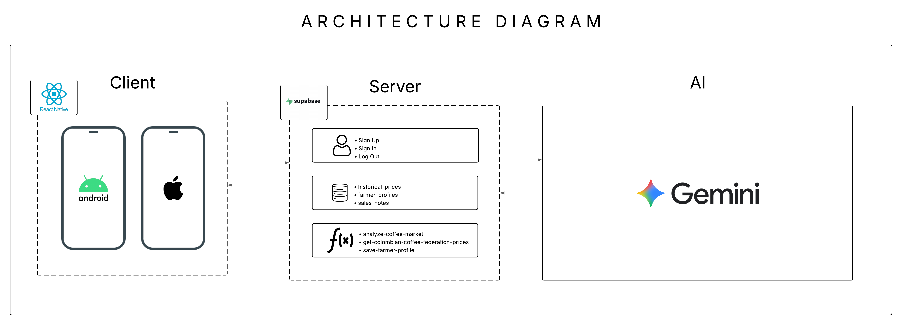
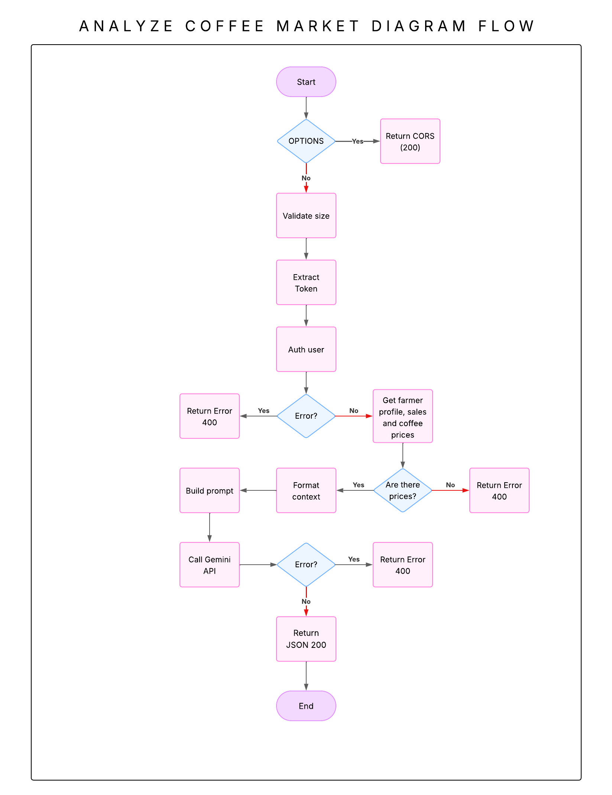
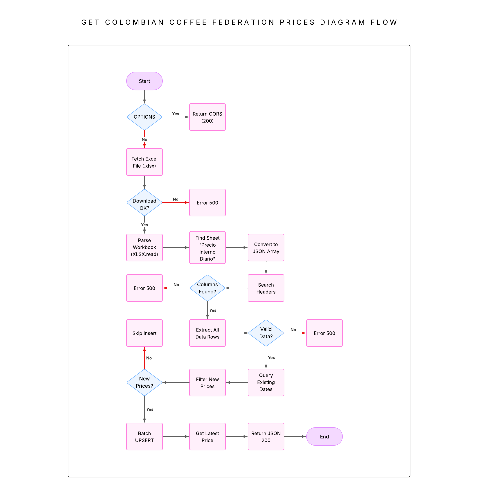
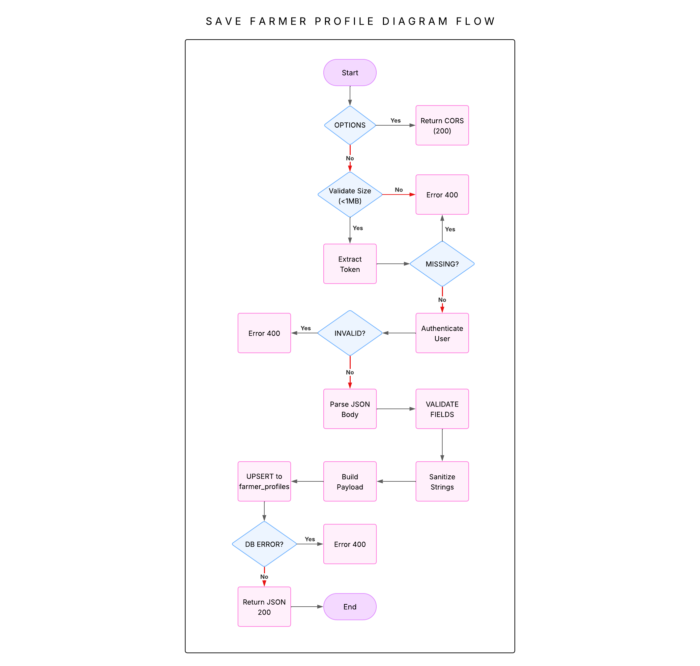
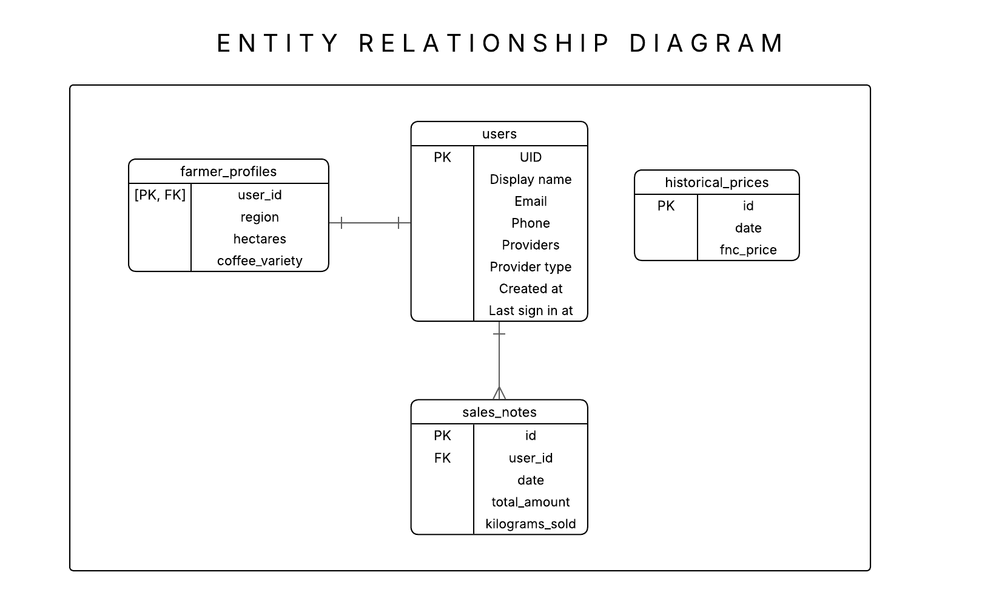

# ☕ Cosecha Próspera

> Aplicación móvil inteligente que ayuda a caficultores colombianos a tomar decisiones informadas sobre el momento óptimo para vender su cosecha.

[](https://reactnative.dev/)
[](https://expo.dev/)
[](https://supabase.com/)
[](https://ai.google.dev/)

---

## 📋 Tabla de Contenidos

- [Descripción del Proyecto](#-descripción-del-proyecto)
- [Características Principales](#-características-principales)
- [Tecnologías Utilizadas](#️-tecnologías-utilizadas)
- [Arquitectura del Sistema](#-arquitectura-del-sistema)
- [Requisitos Previos](#-requisitos-previos)
- [Instalación y Configuración](#-instalación-y-configuración)
- [Variables de Entorno](#-variables-de-entorno)
- [Estructura del Proyecto](#-estructura-del-proyecto)
- [Base de Datos](#️-base-de-datos)
- [Despliegue](#-despliegue)
- [Contribuir](#-contribuir)
- [Licencia](#-licencia)

---

## 🌟 Descripción del Proyecto

**Cosecha Próspera** es una aplicación móvil diseñada para pequeños y medianos caficultores de Colombia (especialmente en regiones como Antioquia, Caldas y Quindío). La app utiliza inteligencia artificial para analizar datos históricos de precios del café y proporcionar recomendaciones personalizadas sobre el momento óptimo de venta.

### Problema que Resuelve

Los caficultores enfrentan incertidumbre al decidir cuándo vender su cosecha debido a:
- Falta de información predictiva sobre variaciones de precios
- Ausencia de herramientas analíticas accesibles
- Presión financiera que obliga a vender prematuramente
- Pérdida de oportunidades en momentos de precios favorables

### Solución

Una aplicación móvil intuitiva que:
- ✅ Muestra precios actuales e históricos del café
- ✅ Proporciona análisis con IA basado en el contexto personal del usuario
- ✅ Permite llevar un diario de ventas personalizado
- ✅ Ofrece recomendaciones específicas y accionables

---

## 🚀 Características Principales

### 1. 🔐 Sistema de Autenticación
- Registro e inicio de sesión con email/contraseña
- Autenticación segura mediante Supabase Auth
- Persistencia de sesión

### 2. 📊 Dashboard de Precios
- Visualización del precio actual de la FNC (Federación Nacional de Cafeteros)
- Indicadores de tendencia
- Gráficos de evolución de precios

### 3. 🤖 Asesor IA con Contexto Personalizado
- Chat conversacional con inteligencia artificial
- Análisis basado en:
  - Datos históricos de precios
  - Perfil del caficultor (región, hectáreas, variedad)
  - Historial personal de ventas
- Recomendaciones específicas y razonadas
- Respuestas en español

### 4. 📝 Diario de Ventas
- Registrar ventas: fecha, monto total, kilogramos vendidos
- Visualizar historial completo
- Estadísticas personales

---

## 📱 Demos

### Demostración en iOS


### Demostración en Android


---

## 🛠️ Tecnologías Utilizadas

### Frontend
- **React Native 0.81+** - Framework multiplataforma
- **Expo 54+** - Herramientas de desarrollo y build
- **Expo Router 6+** - Navegación basada en archivos
- **TypeScript** - Tipado estático
- **React Native Reanimated** - Animaciones fluidas
- **AsyncStorage** - Almacenamiento local

### Backend (BaaS)
- **Supabase** - Backend as a Service
  - PostgreSQL 15+ (Base de datos)
  - Supabase Auth (Autenticación)
  - Edge Functions (Serverless con Deno)
  - Row Level Security (Seguridad de datos)

### Inteligencia Artificial
- **Google Gemini 2.5 Flash** - Modelo de lenguaje
- **Patrón RAG** (Retrieval-Augmented Generation)
- Prompt engineering para respuestas personalizadas

---

## 🏗️ Arquitectura del Sistema



### Flujos de Datos

#### Análisis de Mercado con IA


#### Obtención de Precios FNC


#### Guardado de Perfil


---

## 📦 Requisitos Previos

Antes de comenzar, asegúrate de tener instalado:

- **Node.js 18+** - [Descargar aquí](https://nodejs.org/)
- **npm** o **yarn** - Viene con Node.js
- **Git** - [Descargar aquí](https://git-scm.com/)
- **Expo CLI** - Se instalará en el proceso
- **Expo Go** (app móvil) - Para probar en dispositivo físico
  - [iOS](https://apps.apple.com/app/expo-go/id982107779)
  - [Android](https://play.google.com/store/apps/details?id=host.exp.exponent)

### Cuentas Necesarias

1. **Cuenta de Supabase** (gratuita)
   - 📖 [Tutorial: Cómo crear cuenta en Supabase](https://supabase.com/docs/guides/getting-started)
   
2. **Cuenta de Google AI Studio** (gratuita)
   - 📖 [Tutorial: Cómo obtener API Key de Gemini](https://ai.google.dev/gemini-api/docs/api-key)

---

## 🔧 Instalación y Configuración

### Paso 1: Clonar el Repositorio

```bash
git clone https://github.com/tu-usuario/cosecha-prospera.git
cd cosecha-prospera
```

### Paso 2: Instalar Dependencias

```bash
npm install
# o si usas yarn:
yarn install
```

### Paso 3: Configurar Supabase

#### 3.1 Crear Proyecto en Supabase

1. Ve a [https://supabase.com/dashboard](https://supabase.com/dashboard)
2. Click en **"New Project"**
3. Completa los datos:
   - **Name**: `cosecha-prospera`
   - **Database Password**: Guarda esta contraseña
   - **Region**: South America (São Paulo)
   - **Pricing Plan**: Free
4. Espera 2-3 minutos mientras se crea el proyecto

#### 3.2 Obtener Credenciales

1. En tu proyecto de Supabase, ve a **Settings → API**
2. Copia estos valores:
   - **Project URL**: `https://xxxxx.supabase.co`
   - **anon/public key**: `eyJhbGc...` (es una clave larga)

#### 3.3 Crear las Tablas

1. Ve a **SQL Editor** en el dashboard de Supabase
2. Click en **"New Query"**
3. Copia y pega el contenido del archivo `supabase/db/schema.sql`:

```sql
-- 1. Historical Prices Table
create table public.historical_prices (
  id bigint generated by default as identity primary key,
  date date not null unique,
  fnc_price decimal(12,2) not null,
  created_at timestamp with time zone default timezone('utc'::text, now()) not null
);

alter table public.historical_prices enable row level security;

create policy "Public read access for historical prices"
  on public.historical_prices for select
  using ( auth.role() = 'authenticated' );

-- 2. Farmer Profiles Table
create table public.farmer_profiles (
  user_id uuid references auth.users(id) on delete cascade primary key,
  region text,
  hectares decimal(5,2),
  coffee_variety text,
  created_at timestamp with time zone default timezone('utc'::text, now()) not null,
  updated_at timestamp with time zone default timezone('utc'::text, now()) not null
);

alter table public.farmer_profiles enable row level security;

create policy "Users can view own profile"
  on public.farmer_profiles for select
  using ( auth.uid() = user_id );

create policy "Users can update own profile"
  on public.farmer_profiles for update
  using ( auth.uid() = user_id );

create policy "Users can insert own profile"
  on public.farmer_profiles for insert
  with check ( auth.uid() = user_id );

-- 3. Sales Notes Table
create table public.sales_notes (
  id bigint generated by default as identity primary key,
  user_id uuid references auth.users(id) on delete cascade not null,
  date date not null,
  total_amount decimal(12,2) not null,
  kilograms_sold decimal(10,2) not null,
  created_at timestamp with time zone default timezone('utc'::text, now()) not null
);

alter table public.sales_notes enable row level security;

create policy "Users can view own sales notes"
  on public.sales_notes for select
  using ( auth.uid() = user_id );

create policy "Users can insert own sales notes"
  on public.sales_notes for insert
  with check ( auth.uid() = user_id );

create policy "Users can update own sales notes"
  on public.sales_notes for update
  using ( auth.uid() = user_id );

create policy "Users can delete own sales notes"
  on public.sales_notes for delete
  using ( auth.uid() = user_id );
```

4. Click en **"Run"** para ejecutar el script

#### 3.4 Desplegar Edge Functions

1. Instala Supabase CLI si no lo tienes.
2. Login en Supabase CLI:
   ```bash
   supabase login
   ```
3. Linkea tu proyecto local con el remoto:
   ```bash
   supabase link --project-ref tu-project-ref
   ```
4. Configura los secretos (API Key de Gemini):
   ```bash
   supabase secrets set GEMINI_API_KEY=tu_api_key_de_gemini
   ```
5. Despliega las funciones:
   ```bash
   supabase functions deploy analyze-coffee-market
   supabase functions deploy get-colombian-coffee-federation-prices
   supabase functions deploy save-farmer-profile
   ```

### Paso 4: Configurar Google Gemini

1. Ve a [https://aistudio.google.com/](https://aistudio.google.com/)
2. Inicia sesión con tu cuenta de Google
3. Click en **"Get API Key"**
4. Click en **"Create API Key"**
5. Copia la clave y úsala en el paso anterior (Supabase Secrets).

---

## 🔑 Variables de Entorno

Crea un archivo `.env` en la raíz del proyecto con las siguientes variables:

```properties
# Supabase Configuration
EXPO_PUBLIC_SUPABASE_URL=https://xxxxx.supabase.co
EXPO_PUBLIC_SUPABASE_ANON_KEY=eyJhbGc...
```

> **Nota**: La `GEMINI_API_KEY` se maneja del lado del servidor (Supabase Edge Functions) por seguridad y no debe estar en el cliente.

---

## 📁 Estructura del Proyecto

```
cosecha-prospera/
├── app/                         # Expo Router (Rutas y Navegación)
│   ├── (tabs)/                  # Navegación principal
│   ├── auth/                    # Pantallas de autenticación
│   ├── ai-analysis/             # Pantalla de análisis
│   ├── profile/                 # Pantalla de perfil
│   ├── sales-diary/             # Pantalla de diario
│   └── _layout.tsx              # Configuración raíz
├── components/                  # Componentes UI reutilizables
├── features/                    # Lógica de negocio
│   ├── ai-analysis/             # Lógica de IA
│   ├── auth/                    # Lógica de Auth
│   ├── dashboard/               # Lógica de Dashboard
│   ├── profile/                 # Lógica de Perfil
│   └── sales-diary/             # Lógica de Diario
├── supabase/                    # Backend
│   ├── db/                      # Esquemas SQL
│   └── functions/               # Edge Functions (Deno)
│       ├── analyze-coffee-market/
│       ├── get-colombian-coffee-federation-prices/
│       └── save-farmer-profile/
└── ...
```

---

## 🗄️ Base de Datos

### Diagrama de Relaciones



---

## 🚀 Ejecutar el Proyecto

### Modo Desarrollo

```bash
# Iniciar el servidor de Expo
npm start

# O específicamente para cada plataforma:
npm run android   # Para Android
npm run ios       # Para iOS (solo en macOS)
npm run web       # Para navegador web
```

### Probar en Dispositivo Físico

1. Instala **Expo Go** en tu celular
   - [iOS App Store](https://apps.apple.com/app/expo-go/id982107779)
   - [Android Play Store](https://play.google.com/store/apps/details?id=host.exp.exponent)

2. Ejecuta `npm start`

3. Escanea el QR code:
   - **iOS**: Usa la cámara del iPhone
   - **Android**: Usa la app Expo Go

---

## 🧪 Testing

```bash
# Ejecutar tests
npm test
```

---

## 🤝 Contribuir

Las contribuciones son bienvenidas. Por favor:

1. Fork el proyecto
2. Crea una rama para tu feature (`git checkout -b feature/AmazingFeature`)
3. Commit tus cambios (`git commit -m 'Add some AmazingFeature'`)
4. Push a la rama (`git push origin feature/AmazingFeature`)
5. Abre un Pull Request

---

## 📄 Licencia

Este proyecto está bajo la Licencia MIT. Ver el archivo `LICENSE` para más detalles.

---

## 👥 Autores

- **Carlos Andrés Cardona Quintero** - Desarrollo Full Stack
- **Mateo Valencia Minota** - Desarrollo Full Stack

---

## 🙏 Agradecimientos

- Federación Nacional de Cafeteros de Colombia (FNC) por los datos de precios
- Comunidad de caficultores de Antioquia, Caldas y Quindío
